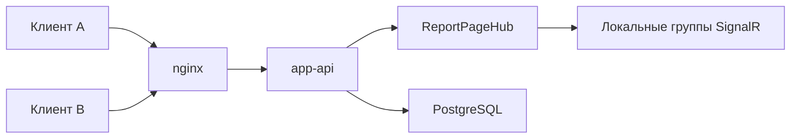
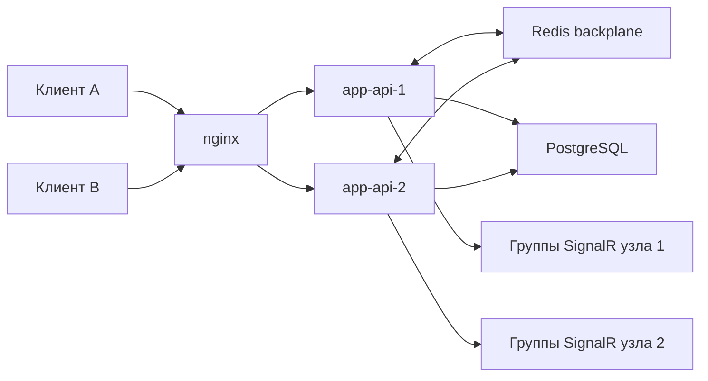
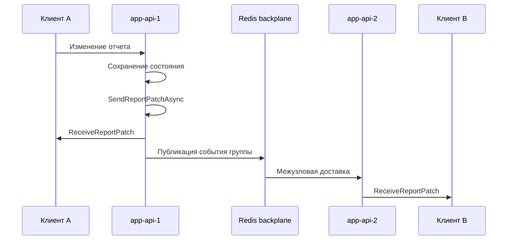

# Черновик содержательной части ВКР

Тема: «Разработка real-time интерфейса с поддержкой горизонтального масштабирования WebSocket-соединений для системы отслеживания задач».

Рабочий тезис: разработан и исследован распределенный real-time контур для совместной работы над сущностями системы, устраняющий ограничение single-node WebSocket-архитектуры.

Черновик подготовлен как основа для последующей сборки `.docx`. Текст ориентирован на требования ГОСТ 7.32-2017 и методические рекомендации кафедры по подготовке отчета по преддипломной практике [11], [12], [13].

## Введение

Современные системы отслеживания задач используются не только как хранилище карточек, статусов и комментариев, но и как рабочая среда для совместной координации действий команды. Пользователи ожидают, что изменения задач, комментариев, вложений, статусов и участников будут отображаться без ручного обновления страницы. Поэтому real-time интерфейс в такой системе следует рассматривать не как декоративный элемент, а как часть прикладного контура совместной работы, обеспечивающую оперативную синхронизацию состояния между участниками [15], [19].

Одним из распространенных способов реализации такого взаимодействия является использование WebSocket-соединений и серверного push-механизма. В веб-приложениях на платформе ASP.NET Core для этого часто применяется SignalR, предоставляющий модель хабов, клиентских событий, групп и автоматического выбора транспорта [1], [2]. Однако простая реализация real-time взаимодействия на одном экземпляре серверного приложения имеет принципиальное ограничение: сведения о подключениях, группах и активных клиентах находятся в памяти конкретного процесса. При запуске нескольких экземпляров backend-сервиса без межузловой синхронизации каждый экземпляр знает только о своих соединениях. В результате пользователь, подключенный к одному узлу, может не получить событие, созданное на другом узле [3].

Актуальность работы определяется необходимостью перехода от single-node real-time решения к архитектуре, допускающей горизонтальное масштабирование WebSocket-соединений. Для системы отслеживания задач это особенно важно, поскольку рост числа пользователей и длительных соединений не должен разрушать целостность real-time пространства. Масштабирование серверной части должно сохранять функциональное свойство интерфейса: все заинтересованные клиенты должны получать события изменения сущностей независимо от того, к какому экземпляру backend-сервиса они подключены [3], [4].

Научно-техническая проблема работы состоит в обеспечении корректной доставки real-time событий в многосерверной конфигурации, где состояние WebSocket-подключений локально для отдельных серверных экземпляров. Решение этой проблемы требует выбора архитектуры межузловой доставки, реализации ее в целевой системе и экспериментального подтверждения того, что ограничение single-node WebSocket-архитектуры устранено.

Объектом исследования являются процессы real-time взаимодействия пользователей в веб-системах совместной работы над сущностями системы отслеживания задач.

Предметом исследования являются архитектурные и программные средства построения WebSocket-контура с горизонтальным масштабированием, межузловой доставкой событий и восстановлением соединений в системе на базе SignalR.

Цель работы: разработать и исследовать real-time интерфейс для системы отслеживания задач, в котором WebSocket-соединения обслуживаются несколькими экземплярами серверного приложения, а события об изменении сущностей корректно доставляются клиентам независимо от узла подключения.

Для достижения цели поставлены следующие задачи:

1. Проанализировать предметную область real-time взаимодействия в системах совместной работы.
2. Рассмотреть ограничения single-node WebSocket-архитектуры при горизонтальном масштабировании.
3. Сравнить подходы к масштабированию real-time контура и обосновать выбор архитектуры.
4. Проанализировать текущую реализацию real-time взаимодействия в целевой системе.
5. Спроектировать масштабируемый real-time контур с несколькими экземплярами backend-сервиса.
6. Реализовать выбранное решение в отдельной ветке проекта.
7. Подготовить минимальный воспроизводимый стенд для проверки результата.
8. Провести испытания в режимах с межузловой доставкой и без нее.
9. Оценить результаты и сформулировать вывод об устранении ограничения single-node архитектуры.

Элемент новизны работы заключается в инженерно-исследовательском обосновании и экспериментальной проверке распределенного real-time контура для системы отслеживания задач. В рамках работы не разрабатывается новый сетевой протокол, но выполняется авторская композиция архитектурного решения, включающая SignalR, несколько экземпляров backend-сервиса, балансировщик, Redis backplane, диагностический контур и воспроизводимую программу испытаний [2], [4], [8], [10].

Практическая значимость работы состоит в создании прототипа масштабируемого real-time контура, который может быть использован как основа для дальнейшего развития системы отслеживания задач. Подготовленные конфигурации, диагностические средства и сценарии испытаний позволяют воспроизводимо демонстрировать переход от single-node реализации к multi-instance режиму с корректной межузловой доставкой событий.

Оформление текстовой части, списка использованных источников и версии отчета по преддипломной практике выполняется с учетом требований ГОСТ 7.32-2017, ГОСТ Р 7.0.100-2018 и методических рекомендаций кафедры [11], [12], [13].

## 1. Анализ предметной области и существующих подходов

### 1.1 Real-time взаимодействие в системах отслеживания задач

Системы отслеживания задач предназначены для фиксации, распределения и контроля выполнения работ. В таких системах ключевыми сущностями являются задачи, отчеты, комментарии, вложения, исполнители, статусы, команды и рабочие пространства. В отличие от статичных справочников, эти сущности часто изменяются несколькими пользователями в течение короткого времени. Один участник может изменить статус задачи, второй добавить комментарий, третий прикрепить файл или уточнить шаг воспроизведения ошибки [16], [18].

Если изменения становятся видимыми только после ручного обновления страницы, у пользователей возникает рассогласованное представление о состоянии системы. Это приводит к дублированию действий, работе с устаревшими данными и дополнительным коммуникационным издержкам. Поэтому для систем отслеживания задач важна поддержка согласованного представления о состоянии объекта: пользователь должен понимать, что объект уже изменился, кто присоединился к работе, какие комментарии или вложения появились и какие поля были обновлены [15], [19].

В контексте данной работы real-time интерфейс определяется как интерфейсный и серверный контур, обеспечивающий оперативное распространение событий изменения сущностей между клиентами. Такой контур включает клиентское WebSocket-соединение, серверный хаб, модель подписок, механизм групп, доставку событий и обработку переподключений [1], [2], [5], [6], [14].

### 1.2 WebSocket и SignalR как основа real-time контура

WebSocket обеспечивает двусторонний обмен данными поверх одного длительно открытого соединения. Для web-интерфейсов совместной работы это удобнее, чем периодический polling, поскольку сервер может самостоятельно отправлять клиентам события сразу после изменения состояния. В платформе ASP.NET Core над WebSocket часто используется SignalR. Он предоставляет более высокоуровневую модель: серверные хабы, клиентские методы, группы, отправку событий конкретным пользователям или всем участникам группы [1], [2].

Для системы отслеживания задач особенно полезна модель групп. Клиент может вступить в группу, соответствующую конкретному отчету или задаче, после чего сервер отправляет события изменения только заинтересованным участникам. Такой подход снижает лишний трафик и делает real-time контур предметно ориентированным: событие связано не с абстрактным каналом, а с конкретной сущностью системы [5].

В то же время группы SignalR являются оперативным механизмом доставки, а не долговременным источником истины. Сведения о членстве соединений в группах хранятся в памяти серверного процесса и не должны использоваться как единственная база для авторизации, аудита или долговременного учета присутствия. Это обстоятельство важно при проектировании масштабируемого контура, поскольку при переподключении клиент должен заново восстановить необходимые подписки [5], [6].

### 1.3 Ограничение single-node WebSocket-архитектуры

Single-node архитектура означает, что все WebSocket-соединения обслуживаются одним экземпляром backend-сервиса. Такой вариант прост в реализации и достаточен для раннего прототипа. Сервер хранит локальную таблицу активных соединений и групп, а при изменении сущности отправляет событие клиентам, подключенным к этому же процессу [3], [5].

Проблема возникает при горизонтальном масштабировании. Если приложение запускается в нескольких экземплярах, входящий трафик распределяется между ними балансировщиком. Клиент A может оказаться подключенным к `app-api-1`, а клиент B — к `app-api-2`. Если событие изменения отчета создано на первом узле, то без межузловой синхронизации второй узел не узнает, что нужно отправить событие своим клиентам. Формально система уже имеет два backend-экземпляра, но real-time пространство фрагментируется на независимые острова [3], [10].

Для системы совместной работы это является функциональным дефектом. Пользователь не обязан знать, через какой серверный процесс он подключен. Ожидаемое свойство интерфейса состоит в том, что изменение сущности доставляется всем заинтересованным участникам. Следовательно, поддержка горизонтального масштабирования WebSocket-соединений должна включать не только запуск нескольких процессов, но и межузловую доставку событий [3], [15].

### 1.4 Сравнение подходов к масштабированию

В рамках работы рассматривались несколько подходов к построению масштабируемого real-time контура [3], [4], [7], [9], [10].

| Подход | Межузловая доставка событий | Сложность внедрения | Применимость для ВКР | Ограничения |
| --- | --- | --- | --- | --- |
| Один экземпляр backend-сервиса | Нет | Низкая | Подходит только как baseline | Нет горизонтального масштабирования, один узел является точкой отказа |
| Несколько экземпляров без backplane | Нет | Низкая или средняя | Хорошо показывает проблему | Real-time пространство фрагментируется по узлам |
| Sticky sessions | Нет, если нет отдельной синхронизации | Средняя | Может использоваться как часть инфраструктуры | Удерживает клиента на узле, но не доставляет события другим узлам |
| Redis backplane для SignalR | Да | Средняя | Оптимален для self-hosted стенда | Подходит для transient UI-событий, зависит от Redis и сетевой задержки |
| Broker/event bus | Да | Высокая | Избыточен для минимального стенда | Требует проектирования схем событий, persistence и consumer-групп |
| Managed real-time service | Да | Средняя | Полезен для сравнения | Уменьшает демонстрируемый вклад в построение собственного серверного контура |

Для цели данной ВКР выбран подход SignalR + Redis backplane. Он соответствует self-hosted характеру стенда, не требует радикальной перестройки доменной логики и позволяет экспериментально проверить межузловую доставку событий. При этом решение остается достаточно простым, чтобы его можно было воспроизвести в учебной работе и показать на защите [4], [9].

### 1.5 Вывод по главе

Анализ показал, что real-time интерфейс в системе отслеживания задач должен рассматриваться как контур совместной работы над сущностями, а не только как клиентский WebSocket. Главным ограничением single-node реализации является локальность сведений о соединениях и группах. Для устранения этого ограничения требуется архитектура, в которой несколько экземпляров backend-сервиса обмениваются real-time событиями через межузловой механизм. Для рассматриваемой системы рациональным решением является использование Redis backplane в составе SignalR [3], [4], [15].

## 2. Анализ целевой системы и постановка задачи

### 2.1 Характеристика целевой системы

Целевая система представляет собой веб-систему для работы с отчетами, задачами, комментариями, вложениями и связанными сущностями. В рамках ВКР рассматривается не вся продуктовая инфраструктура, а минимальный контур real-time взаимодействия: прикладной backend-сервис `app-api`, PostgreSQL, Redis, reverse proxy на nginx и отдельный проверочный клиент.

Работа по ВКР ведется в отдельной ветке `thesis/realtime-scaleout`. Это позволяет реализовать и исследовать изменения без необходимости немедленного слияния с основной веткой проекта. Такой подход важен для ВКР: реализация является доказательной базой, но при этом не нарушает стабильность основного продукта.

### 2.2 Исходная реализация real-time взаимодействия

В исходной системе уже присутствует SignalR-хаб `ReportPageHub`, опубликованный по маршруту `/v1/report-page-hub`. Клиентское приложение устанавливает соединение через SignalR и использует автоматическое переподключение. Для подписки на изменения конкретного отчета клиент вызывает метод вступления в группу. Серверная отправка событий централизована в `ReportPageHubClient` [2], [5], [6].

Real-time события охватывают несколько типов изменений: обновление отчета, создание и изменение багов, комментариев, вложений, ссылок и шагов воспроизведения. Это подтверждает, что real-time контур связан с предметной областью системы и используется для совместной работы над сущностями, а не является изолированной демонстрационной функцией.

При этом в исходной инфраструктурной конфигурации upstream `app-api` указывал на один экземпляр backend-сервиса. Даже при наличии Redis в составе общего compose-стенда SignalR не использовал Redis как backplane для межузловой доставки. Поэтому исходный контур можно охарактеризовать как функциональный single-node real-time механизм [3], [4].

### 2.3 Требования к разрабатываемому решению

Функциональные требования:

1. Система должна поддерживать подключение клиентов к SignalR-хабу через reverse proxy.
2. Клиент должен иметь возможность вступить в группу, соответствующую отчету.
3. Изменения сущностей отчета должны доставляться всем клиентам, подписанным на группу.
4. Клиенты, подключенные к разным экземплярам backend-сервиса, должны получать одно и то же real-time событие.
5. Клиент должен восстанавливать соединение после разрыва и повторно вступать в необходимые группы.
6. Для демонстрации должен быть доступен диагностический способ определить `serverInstanceId` и `connectionId`.

Нефункциональные требования:

1. Решение должно запускаться на минимальном локальном стенде.
2. Основной сценарий проекта не должен быть сломан изменениями под ВКР.
3. Подключение Redis backplane должно быть конфигурируемым через переменную окружения.
4. Реализация должна сохранять совместимость существующих payload'ов real-time событий.
5. Доказательная база должна включать воспроизводимые сценарии испытаний.

### 2.4 Постановка задачи

Необходимо разработать и проверить масштабируемый real-time контур для системы отслеживания задач. Для этого требуется:

1. Добавить возможность подключения SignalR к Redis backplane.
2. Подготовить multi-instance стенд с двумя экземплярами `app-api`.
3. Настроить nginx так, чтобы входящий трафик распределялся между экземплярами backend-сервиса и корректно проксировались WebSocket-соединения.
4. Добавить диагностические данные, позволяющие установить, к какому узлу подключен клиент.
5. Подготовить простой проверочный клиент, фиксирующий серверный узел, идентификатор соединения и факт получения события.
6. Реализовать автоматизированный сценарий проверки cross-node delivery.
7. Сравнить поведение системы в режимах с Redis backplane и без него.

## 3. Проектирование масштабируемого real-time контура

### 3.1 Исходная архитектура

В исходном варианте real-time взаимодействие строится вокруг одного экземпляра `app-api`. Все клиенты устанавливают WebSocket-соединение с одним серверным процессом. Этот процесс хранит сведения о соединениях и группах, а при изменении сущности отправляет событие в нужную группу [3], [5].

Схема исходной архитектуры представлена на рисунке 1.



Недостаток этой архитектуры состоит в том, что она не показывает, как система должна вести себя при нескольких экземплярах `app-api`. Если просто добавить второй экземпляр без backplane, каждый процесс будет иметь собственное локальное состояние соединений [3].

### 3.2 Целевая архитектура

В целевой архитектуре перед backend-сервисами находится nginx, а приложение запускается в двух экземплярах: `app-api-1` и `app-api-2`. Оба экземпляра подключены к общей базе данных и к Redis. SignalR использует Redis backplane для межузловой доставки событий [4], [10], [14].

Схема целевой архитектуры представлена на рисунке 2.



Целевое свойство архитектуры: если событие создано на `app-api-1`, оно должно быть доставлено клиентам группы, даже если часть этих клиентов подключена к `app-api-2`. Redis backplane выполняет роль механизма межузловой публикации и подписки для SignalR [4], [9].

### 3.3 Поток real-time события

Поток события в целевой архитектуре выглядит следующим образом:

1. Пользователь выполняет действие в интерфейсе, например изменяет заголовок отчета.
2. HTTP-запрос попадает через nginx на один из экземпляров backend-сервиса.
3. Backend изменяет прикладное состояние в базе данных.
4. `ReportPageHubClient` формирует real-time событие для группы отчета.
5. SignalR отправляет событие локальным клиентам текущего узла.
6. Через Redis backplane событие становится доступным другим экземплярам `app-api`.
7. Другой экземпляр доставляет событие своим клиентам, состоящим в той же группе.
8. Проверочный клиент получает событие и фиксирует результат доставки.

Последовательность межузловой доставки события представлена на рисунке 3.



### 3.4 Модель групп и повторной подписки

Группа SignalR соответствует контексту отчета. При открытии страницы отчета клиент вызывает метод вступления в группу. На сервере идентификатор отчета разрешается с учетом alias/public/team контекста, после чего формируется ключ группы. Такой подход позволяет объединить в одну real-time область всех клиентов, работающих с одним отчетом.

Поскольку membership группы является оперативным состоянием SignalR, клиент должен повторять вступление в группу после переподключения. В проверочном клиенте и клиентском real-time слое используется автоматическое восстановление соединения и повторное присоединение к группе отчета. В рамках ВКР это свойство рассматривается как часть устойчивости real-time контура [5], [6].

### 3.5 Диагностический контур

Для доказательства результата недостаточно утверждать, что событие доставлено. Нужно показать, что клиенты действительно подключены к разным экземплярам backend-сервиса. Поэтому в проект добавлен диагностический контур:

1. `SERVER_INSTANCE_ID` задает идентификатор экземпляра сервиса.
2. `ServerInstanceInfo` предоставляет идентификатор экземпляра и имя машины.
3. `ReportPageHub.GetConnectionDiagnosticsAsync()` возвращает клиенту `serverInstanceId`, `machineName`, `connectionId` и `userIdentifier`.
4. Backend логирует подключение, вступление в группу, выход из группы, отключение и отправку real-time события.
5. Проверочный клиент выводит diagnostics в JSON-результате эксперимента.

Такой контур не меняет бизнес-payload'ы событий, но повышает наблюдаемость и делает эксперимент проверяемым [8].

## 4. Реализация решения в целевой системе

### 4.1 Организация работ

Реализация выполнена в ветке `thesis/realtime-scaleout`. Выбор отдельной ветки позволяет изолировать изменения, связанные с ВКР, от основного потока разработки. Это важно, поскольку часть артефактов имеет демонстрационный и исследовательский характер: отдельный compose-стенд, диагностические методы и проверочный скрипт.

### 4.2 Изменения backend

В backend добавлена поддержка Redis backplane для SignalR. В конфигурации приложения появилась переменная окружения `REDIS_CONNECTION_STRING`. Если она задана, при инициализации SignalR вызывается подключение `AddStackExchangeRedis`. Если переменная не задана или пустая, приложение продолжает работать в single-node режиме без backplane. Это позволяет запускать один и тот же код в двух исследовательских режимах: с межузловой доставкой и без нее [4].

Для разделения каналов SignalR используется prefix `app-api-realtime`. Это снижает риск пересечения сообщений с другими возможными приложениями или окружениями, использующими тот же Redis [4], [9].

Также добавлена переменная `SERVER_INSTANCE_ID`. Значение используется для логирования и диагностики. Если переменная не задана, сервис может использовать имя машины как fallback. На стенде ВКР экземпляры получают явные значения `app-api-1` и `app-api-2`.

В `ReportPageHub` добавлен метод `GetConnectionDiagnosticsAsync()`. Он позволяет клиенту получить текущий `connectionId` и идентификатор серверного экземпляра, через который установлено SignalR-соединение. Кроме того, в хаб добавлено логирование ключевых событий жизненного цикла соединения: подключение, вступление в группу, выход из группы и отключение [8].

В `ReportPageHubClient` централизована отправка событий в группы через метод `SendToGroupAsync`. При отправке создается `eventId`, логируются имя события, ключ группы, идентификатор серверного экземпляра и исключаемый connectionId. Существующие payload'ы событий сохранены, что снижает риск регрессий в прикладной логике [5], [8].

### 4.3 Проверочный клиент

Для доказательства результата подготовлен простой Node.js-клиент, который не зависит от пользовательского интерфейса продукта. Клиент напрямую подключается к двум экземплярам `app-api`, вызывает метод `GetConnectionDiagnosticsAsync()` и фиксирует `serverInstanceId`, `connectionId`, идентификатор отчета и полученное real-time событие [6], [8].

Такой подход делает эксперимент независимым от полноценного пользовательского интерфейса. ВКР проверяет именно серверный real-time контур и межузловую доставку событий, а не особенности конкретного экрана клиентского приложения.

Клиент использует WebSocket-транспорт SignalR, подключается к двум разным адресам узлов и передает необходимые заголовки тестовой идентичности. При изменении отчета через первый узел клиент ожидает событие на соединении, открытом ко второму узлу.

### 4.4 Инфраструктурные изменения

Для ВКР подготовлен отдельный compose-стенд `docker-compose.thesis.yml`. Он включает:

1. `postgres_app_thesis`;
2. `redis_app_thesis`;
3. `app-api-1`;
4. `app-api-2`;
5. `nginx_app_thesis`.

Оба экземпляра `app-api` собираются из одного Dockerfile, подключаются к одной базе данных и одному Redis, но получают разные значения `SERVER_INSTANCE_ID`. Для проверки исходного ограничения добавлен override `docker-compose.thesis.no-backplane.yml`, который устанавливает `REDIS_CONNECTION_STRING` в пустую строку для обоих экземпляров [17].

Отдельный nginx upstream `upstreams.thesis.conf` содержит два backend-сервера [10]:

```nginx
upstream app-api {
    zone app-api 64k;
    server app-api-1:7777;
    server app-api-2:7777;
}
```

Для стенда добавлена отдельная конфигурация nginx, в которой reverse proxy направляет HTTP- и WebSocket-трафик на upstream `app-api`. Конфигурация не зависит от дополнительных сервисов авторизации или пользовательского профиля и предназначена только для проверки real-time контура [10], [14].

### 4.5 Автоматизированный сценарий проверки

Для воспроизводимой проверки добавлен сценарий `npm run test:realtime-scaleout`. Он выполняет следующие действия:

1. Создает отчет через `app-api-1`.
2. Подключает SignalR-клиент A к `app-api-1`.
3. Подключает SignalR-клиент B к `app-api-2`.
4. Подписывает оба клиента на группу созданного отчета.
5. Изменяет заголовок отчета через `app-api-1`.
6. Ожидает событие `ReceiveReportPatch` на клиенте B.
7. Измеряет задержку от отправки PATCH-запроса до получения события на клиенте B.
8. Выводит diagnostics обоих клиентов, полученный payload события и метрики доставки.

Такой сценарий важен, потому что он исключает случайность балансировки: клиенты намеренно подключаются к разным backend-узлам. Если событие приходит клиенту на втором узле, это является прямым подтверждением межузловой доставки.

Для получения простой количественной оценки сценарий поддерживает серийный режим через переменную `THESIS_ITERATIONS`. В этом режиме выполняется несколько независимых проверок, после чего скрипт выводит число успешных доставок и агрегированные значения задержки: минимум, максимум, среднее, p50 и p95. Дополнительно предусмотрены режимы `THESIS_SCENARIO=rejoin` и `THESIS_SCENARIO=failover`: первый проверяет повторное вступление в группу после разрыва соединения, второй — переподключение через nginx после остановки одного экземпляра `app-api`.

## 5. Испытания и оценка результатов

### 5.1 Цель и программа испытаний

Цель испытаний — подтвердить, что реализованное решение устраняет ограничение single-node WebSocket-архитектуры и обеспечивает доставку real-time событий между клиентами, подключенными к разным экземплярам backend-сервиса [3], [4].

Программа испытаний включает два основных режима:

1. Multi-instance без Redis backplane.
2. Multi-instance с Redis backplane.

Первый режим нужен для воспроизведения проблемы. Второй режим нужен для подтверждения результата. Оба режима используют один и тот же код, один и тот же сценарий проверки и отличаются только значением `REDIS_CONNECTION_STRING`.

### 5.2 Стенд испытаний

Стенд запускается в локальном окружении Docker Compose. В режиме с backplane используются два экземпляра `app-api`, Redis, PostgreSQL и nginx. Полноценный пользовательский интерфейс и дополнительные продуктовые сервисы не входят в доказательный контур, поскольку проверка выполняется отдельным Node.js-клиентом.

Команда запуска режима с Redis backplane:

```bash
cd <project-root>
docker compose -f docker-compose.thesis.yml up -d --build
```

Команда запуска режима без Redis backplane:

```bash
cd <project-root>
docker compose -f docker-compose.thesis.yml -f docker-compose.thesis.no-backplane.yml up -d --build
```

Проверочный клиент запускается командой:

```bash
cd <project-root>
node scripts/realtime-scaleout-check.mjs
```

Для серийной проверки доставки и задержки используется команда:

```bash
cd <project-root>
THESIS_ITERATIONS=5 node scripts/realtime-scaleout-check.mjs
```

Для проверки восстановления подписки и отказа узла используются команды:

```bash
THESIS_SCENARIO=rejoin node scripts/realtime-scaleout-check.mjs
THESIS_SCENARIO=failover THESIS_ALLOW_DOCKER_CONTROL=1 THESIS_TIMEOUT_MS=20000 node scripts/realtime-scaleout-check.mjs
```

### 5.3 Результат без Redis backplane

В режиме без backplane оба экземпляра `app-api` работают, но SignalR не имеет межузлового канала доставки событий. Проверочный сценарий завершился timeout:

```text
Error: ReceiveReportPatch timed out after 10000ms
```

Интерпретация результата: клиент A был подключен к одному экземпляру сервиса, клиент B — к другому. Событие изменения отчета было создано через первый экземпляр, но не дошло до клиента, подключенного ко второму экземпляру. Этот результат подтверждает исходное архитектурное ограничение: простой запуск нескольких backend-процессов не обеспечивает глобальную real-time доставку [3].

### 5.4 Результат с Redis backplane

В режиме с Redis backplane проверочный сценарий завершился успешно. Один из зафиксированных результатов:

```json
{
  "ok": true,
  "reportId": "3",
  "patchedTitle": "scaleout-patched-1778316874715",
  "nodeA": {
    "serverInstanceId": "app-api-1",
    "machineName": "21ee5de48b13",
    "connectionId": "9iIIs9uWgfJlf6BHXER8XA",
    "userIdentifier": "thesis-user"
  },
  "nodeB": {
    "serverInstanceId": "app-api-2",
    "machineName": "1d6a8589cdae",
    "connectionId": "NpH7DSAYYJW1EWM2XKhyqQ",
    "userIdentifier": "thesis-user"
  },
  "receivedPatch": {
    "title": "scaleout-patched-1778316874715",
    "updatedAt": "2026-05-09T08:54:35.186614+00:00"
  },
  "metrics": {
    "deliveryLatencyMs": 9.5,
    "patchRequestMs": 8.5
  }
}
```

Из результата видно, что клиент A был подключен к `app-api-1`, а клиент B — к `app-api-2`. При этом клиент B получил событие `ReceiveReportPatch`, инициированное через первый узел. Это подтверждает, что Redis backplane обеспечил межузловую доставку real-time события [4], [9].

### 5.5 Серийная проверка и задержка доставки

Для дополнительной проверки был выполнен серийный запуск из пяти независимых итераций в режиме с Redis backplane:

```bash
THESIS_ITERATIONS=5 node scripts/realtime-scaleout-check.mjs
```

Результат:

```json
{
  "ok": true,
  "iterations": 5,
  "successful": 5,
  "failed": 0,
  "latencyMs": {
    "min": 5.5,
    "max": 11.6,
    "avg": 8.4,
    "p50": 9.1,
    "p95": 11.6
  }
}
```

Все пять проверок завершились успешно: каждый раз клиент, подключенный к `app-api-2`, получал событие, инициированное через `app-api-1`. Измеренная задержка доставки в локальном стенде составила в среднем 8,4 мс, p50 — 9,1 мс, p95 — 11,6 мс. Эти значения не следует трактовать как промышленный нагрузочный тест, поскольку стенд локальный и число итераций невелико. Однако они подтверждают, что реализованная межузловая доставка работает не только в единичном запуске, но и в серии повторных проверок.

### 5.6 Проверка восстановления соединения и отказа узла

Режим `THESIS_SCENARIO=rejoin` проверяет, что после разрыва соединения клиент может создать новое SignalR-подключение, повторно вступить в группу отчета и получить следующее событие. В зафиксированном запуске клиент B сначала был подключен к `app-api-2`, затем получил новое соединение с другим `connectionId`, повторно выполнил `JoinReportGroupAsync` и получил событие `ReceiveReportPatch`. Время повторного подключения и вступления в группу составило 12,9 мс, задержка доставки после повторного вступления — 6,6 мс.

Режим `THESIS_SCENARIO=failover` проверяет поведение при остановке одного экземпляра. Клиент B был подключен через nginx к `app-api-2`, после чего контейнер `app-api-2` был остановлен. SignalR-клиент переподключился через nginx к `app-api-1`, повторно вступил в группу отчета и получил новое событие. Время переподключения и повторного вступления составило 240,3 мс, задержка доставки после failover — 7,3 мс. Для WebSocket-only проверки через балансировщик в клиенте используется `skipNegotiation`, чтобы установить соединение одним WebSocket-запросом и не зависеть от sticky sessions на этапе negotiate.

<!-- PAGE_BREAK -->

### 5.7 Сравнительная таблица результатов

| Режим | Клиенты на разных узлах | Redis backplane | Ожидаемый результат | Фактический результат | Вывод |
| --- | --- | --- | --- | --- | --- |
| Multi-instance без backplane | Да | Нет | Событие не доставляется между узлами | Timeout после 10000 мс | Исходное ограничение воспроизведено |
| Multi-instance с backplane, одиночный запуск | Да | Да | Событие доставляется между узлами | `ok: true`, получен `ReceiveReportPatch` | Ограничение устранено |
| Multi-instance с backplane, 5 итераций | Да | Да | Все события доставляются между узлами | 5 из 5 успешно, p95 = 11,6 мс | Подтверждена повторяемость результата |
| Rejoin после разрыва | Да | Да | После нового подключения клиент повторно вступает в группу | Событие после rejoin получено, 6,6 мс | Подтверждена повторная подписка |
| Failover одного узла | Да | Да | Клиент переподключается через nginx к доступному узлу | `app-api-2` -> `app-api-1`, событие получено | Подтверждено восстановление после отказа |

### 5.8 Проверка входной точки стенда

Дополнительно проверена доступность единой nginx-точки входа. URL `http://localhost:18080/health` возвращает `ok`, а reverse proxy направляет HTTP- и WebSocket-трафик на upstream `app-api`. Это подтверждает, что демонстрационный стенд пригоден для воспроизводимой проверки real-time контура без зависимости от полноценного пользовательского интерфейса и дополнительных продуктовых сервисов.

### 5.9 Ограничения эксперимента

Проведенный эксперимент является минимальным доказательным стендом, а не промышленным нагрузочным тестом. Он проверяет ключевое функциональное свойство: доставку события между клиентами, подключенными к разным серверным экземплярам. В дальнейшем программу испытаний можно расширить:

1. Увеличением числа одновременных клиентов и числа событий.
2. Сравнением поведения при разных стратегиях балансировки.
3. Сбором p99 и распределения задержек на более длинной серии запусков с учетом того, что задержка влияет на качество real-time совместной работы [20].
4. Проверкой поведения при длительной недоступности Redis.

Для текущей цели ВКР уже получен главный результат: режим без backplane воспроизводит проблему, а режим с Redis backplane устраняет ее на том же стенде [3], [4].

### 5.10 Вывод по испытаниям

Испытания подтвердили, что в multi-instance режиме без межузловой синхронизации real-time события не доставляются клиентам, подключенным к другому backend-экземпляру. После подключения Redis backplane событие изменения отчета доставляется между `app-api-1` и `app-api-2`. Серийная проверка показала 5 успешных доставок из 5, p95 задержки в локальном стенде составил 11,6 мс. Дополнительно подтверждены повторное вступление в группу после разрыва соединения и восстановление после остановки одного узла. Таким образом, реализованное решение подтверждает заявленный тезис работы: single-node ограничение WebSocket-архитектуры устранено за счет распределенного real-time контура [3], [4].

## Заключение

В ходе работы была рассмотрена проблема построения real-time интерфейса для системы отслеживания задач в условиях горизонтального масштабирования WebSocket-соединений. Показано, что простая single-node реализация SignalR не обеспечивает корректную работу при нескольких экземплярах backend-сервиса, поскольку сведения о подключениях и группах локальны для каждого процесса [3], [5].

Для решения проблемы была выбрана архитектура на базе нескольких экземпляров `app-api`, nginx как reverse proxy и Redis backplane для межузловой доставки SignalR-событий. В отдельной ветке проекта реализована поддержка конфигурируемого Redis backplane, добавлены идентификаторы серверных экземпляров, диагностический метод хаба, логирование real-time событий, проверочный клиент и воспроизводимый Docker Compose стенд [4], [8], [10], [14].

Экспериментальная проверка показала различие между двумя режимами. При отключенном backplane событие не доставлялось клиенту, подключенному к другому backend-экземпляру. При включенном Redis backplane тот же сценарий завершился успешно: клиент на `app-api-2` получил событие, инициированное через `app-api-1`. Серийный запуск из пяти итераций подтвердил повторяемость результата и позволил получить первичную оценку задержки доставки. Сценарии rejoin и failover показали, что клиент может восстановить рабочую подписку после разрыва соединения и после остановки одного backend-экземпляра. Это подтверждает устранение ограничения single-node WebSocket-архитектуры [3], [4].

Полученные результаты имеют практическую значимость для дальнейшего развития системы отслеживания задач, поскольку предложенное решение позволяет перейти от локального real-time механизма к масштабируемому контуру совместной работы над сущностями. В дальнейшем решение может быть расширено дополнительной трассировкой событий, более длинной серией измерений задержек, проверкой на большем числе одновременных клиентов и анализом поведения при недоступности Redis [8], [19].

## Список использованных источников

1. Fette I., Melnikov A. The WebSocket Protocol: RFC 6455. IETF, 2011. URL: https://www.rfc-editor.org/rfc/rfc6455 (дата обращения: 09.05.2026).
2. Microsoft. Overview of ASP.NET Core SignalR. URL: https://learn.microsoft.com/en-us/aspnet/core/signalr/introduction (дата обращения: 09.05.2026).
3. Microsoft. ASP.NET Core SignalR production hosting and scaling. URL: https://learn.microsoft.com/en-us/aspnet/core/signalr/scale (дата обращения: 09.05.2026).
4. Microsoft. Redis backplane for ASP.NET Core SignalR scale-out. URL: https://learn.microsoft.com/en-us/aspnet/core/signalr/redis-backplane (дата обращения: 09.05.2026).
5. Microsoft. Manage users and groups in SignalR. URL: https://learn.microsoft.com/en-us/aspnet/core/signalr/groups (дата обращения: 09.05.2026).
6. Microsoft. ASP.NET Core SignalR JavaScript client. URL: https://learn.microsoft.com/en-us/aspnet/core/signalr/javascript-client (дата обращения: 09.05.2026).
7. Microsoft. ASP.NET Core SignalR configuration. URL: https://learn.microsoft.com/en-us/aspnet/core/signalr/configuration (дата обращения: 09.05.2026).
8. Microsoft. Logging and diagnostics in ASP.NET Core SignalR. URL: https://learn.microsoft.com/en-us/aspnet/core/signalr/diagnostics (дата обращения: 09.05.2026).
9. Redis Ltd. Redis Pub/Sub. URL: https://redis.io/docs/latest/develop/pubsub/ (дата обращения: 09.05.2026).
10. NGINX. WebSocket proxying. URL: https://nginx.org/en/docs/http/websocket.html (дата обращения: 09.05.2026).
11. ГОСТ 7.32-2017. Система стандартов по информации, библиотечному и издательскому делу. Отчет о научно-исследовательской работе. Структура и правила оформления. М.: Стандартинформ, 2018.
12. ГОСТ Р 7.0.100-2018. Система стандартов по информации, библиотечному и издательскому делу. Библиографическая запись. Библиографическое описание. Общие требования и правила составления. М.: Стандартинформ, 2018.
13. Рогачев С. А., Бабюк Ю. Программная инженерия. Требования к подготовке и содержанию отчетов по практике: учебно-методическое пособие. СПб.: ГУАП, 2025. 40 с.
14. Олифер В. Г., Олифер Н. А. Компьютерные сети. Принципы, технологии, протоколы: учебник. 6-е изд. СПб.: Питер, 2022. 1008 с.
15. Орлов С. А. Программная инженерия: учебник для вузов. 5-е изд. СПб.: Питер, 2016. 640 с.
16. Гагарина Л. Г., Кокорева Е. В., Виснадул Б. Д. Технология разработки программного обеспечения: учебное пособие. М.: ФОРУМ: ИНФРА-М, 2021. 400 с.
17. Советов Б. Я., Цехановский В. В., Чертовской В. Д. Базы данных: теория и практика: учебник. М.: Юрайт, 2020. 463 с.
18. Гвоздева В. А., Баллод Б. А. Основы построения автоматизированных информационных систем: учебник. М.: ФОРУМ: ИНФРА-М, 2020. 320 с.
19. Липаев В. В. Программная инженерия. Методологические основы: учебник. М.: ТЕИС, 2006. 608 с.
20. Куликов С. С. Тестирование программного обеспечения. Базовый курс. Минск: Четыре четверти, 2017. 312 с.

## Список рисунков и таблиц для подготовки

Рисунки:

1. Исходная single-node архитектура real-time контура.
2. Multi-instance архитектура без backplane.
3. Целевая архитектура с Redis backplane.
4. Последовательность доставки события `ReceiveReportPatch` между узлами.
5. Вывод проверочного клиента с diagnostics для разных серверных узлов.

Таблицы:

1. Сравнение подходов к масштабированию WebSocket-соединений.
2. Функциональные и нефункциональные требования.
3. Состав Docker Compose стенда.
4. Сценарии испытаний.
5. Результаты испытаний с backplane и без backplane.
6. Результаты серийной проверки и задержки доставки.
7. Результаты rejoin и failover-проверок.
8. План расширенных метрик для следующего этапа.

## Технические приложения для последующей сборки

В приложения к ВКР целесообразно вынести:

1. Фрагмент `docker-compose.thesis.yml`.
2. Фрагмент `docker-compose.thesis.no-backplane.yml`.
3. Фрагмент `upstreams.thesis.conf`.
4. Фрагмент настройки SignalR с `AddStackExchangeRedis`.
5. Фрагмент `GetConnectionDiagnosticsAsync`.
6. Фрагмент проверочного клиента `realtime-scaleout-check.mjs`.
7. Вывод `npm run test:realtime-scaleout` для режима с Redis backplane.
8. Вывод timeout для режима без Redis backplane.
9. Вывод `THESIS_ITERATIONS=5` с агрегированными задержками.
10. Вывод `THESIS_SCENARIO=rejoin` и `THESIS_SCENARIO=failover`.

## Что нужно сделать на следующем проходе

1. Проверить библиографическое оформление по требованиям кафедры и финализировать список источников по ГОСТ.
2. Сгладить стиль под требования кафедры и убрать технические локальные пути из основного текста.
3. Добавить раздел «Перечень сокращений».
4. Подготовить оформленные схемы вместо Mermaid-блоков.
5. Проверить библиографию и стиль на соответствие требованиям кафедры.
6. После этого подготовить финальную версию отчета по практике на базе текущего DOCX.
